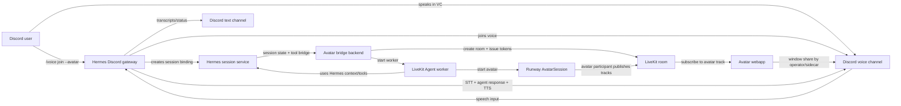
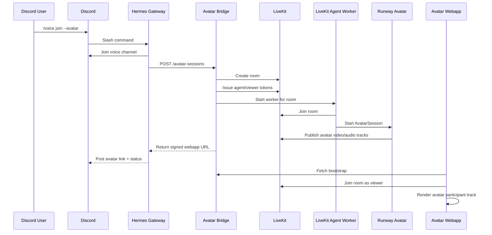
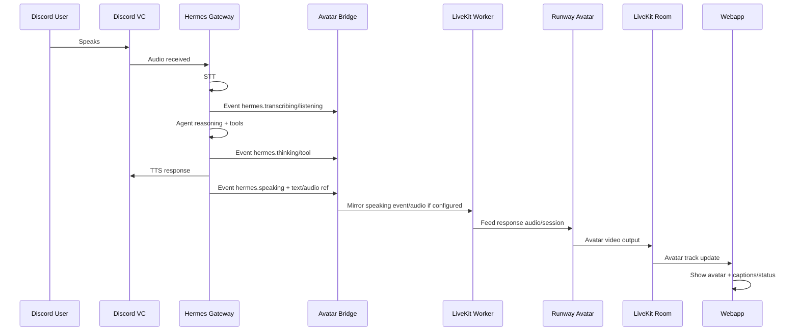
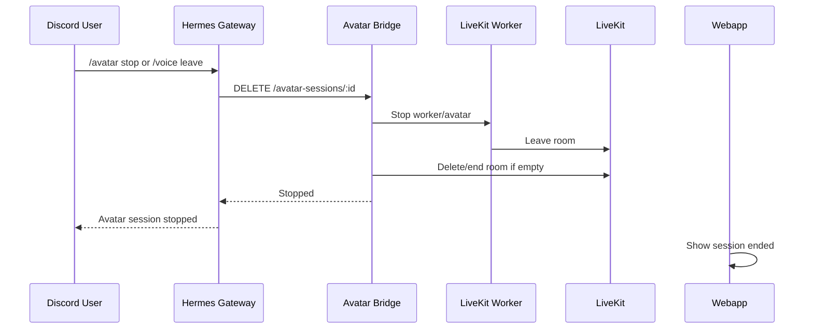

# PRD: Runway Avatar + Hermes Agent + LiveKit + Discord Webapp MVP

## 1. Product summary

Build a hackathon demo where users interact with a Hermes Agent through Discord, while a congruent Runway avatar appears in a dedicated webapp that can be screen-shared into the same Discord voice call.

The core product experience is:

1. A user types `/voice join --avatar` or an equivalent command in Discord.
2. Hermes joins the Discord voice channel using its existing voice mode.
3. A LiveKit room is created and bound to the same Hermes session.
4. A LiveKit Agent worker runs the conversational loop and starts a Runway avatar session.
5. Runway publishes the avatar video into the LiveKit room.
6. A lightweight webapp subscribes to the LiveKit room and renders the avatar as a clean full-screen stage.
7. A human demo operator or companion sidecar shares that webapp window into Discord.
8. Users perceive a single embodied Hermes instance: the Discord bot responds in voice/text, and the shared avatar moves in sync with the same agent state.

The primary MVP is not a Discord-native video bot, not an OBS virtual camera, and not a full replacement for Hermes voice mode. It is a pragmatic webapp-first embodiment layer that uses supported media primitives and avoids low-level Discord RTC complexity during the hackathon.

### 1.1 2026-05-10 feasibility update: Hermes PR #3894

Hermes does not currently ship merged LiveKit support on `main`, but there is an open upstream PR that is directly relevant:

* **NousResearch/hermes-agent#3894** — `feat(gateway): add LiveKit WebRTC voice platform support`
* Branch inspected: `kortexa-ai:kortexa/gateway-livekit`
* Scratch worktree: `scratchpad/hermes-livekit-pr3894-origin-main-worktree`
* Merge check against current `origin/main` (`a2920b176`): **clean no-conflict merge**
* Merge footprint: 12 files, including `gateway/platforms/livekit.py`, `gateway/config.py`, `gateway/run.py`, `pyproject.toml`, `toolsets.py`, and CLI/status plumbing.

The PR adds a Hermes `LiveKitAdapter` that joins a LiveKit room, receives participant audio, buffers PCM, detects silence, runs Hermes STT, routes transcripts through the normal Hermes gateway agent loop, generates Hermes TTS, and publishes the TTS audio back into LiveKit through `rtc.AudioSource`. It also publishes LiveKit data-channel events such as user transcripts, assistant transcripts, thinking state, and speaking start/stop.

This PR should be treated as the **transport foundation** for the hackathon architecture. It is not a Runway avatar integration by itself: it does not include `livekit.agents`, `livekit.plugins.runway`, Runway `AvatarSession`, avatar worker startup, or Discord `/voice join --avatar` orchestration.

### 1.2 Updated product direction

The target hackathon shape is:

> **Hermes remains the brain; LiveKit becomes the voice/media room; Runway becomes the visual avatar speaker.**

Users should be able to cowork with Hermes using tools, memory, and Discord-facing workflow, while the shared avatar is visibly tied to the same Hermes session through LiveKit tracks, captions, and state events. The first reliable version should prioritize congruent state and recoverable demo flow over perfect lip-sync.

---

## 2. Goals

### 2.1 User-facing goals

* Give Hermes a visible, expressive avatar presence during Discord conversations.
* Keep Discord as the primary human interaction surface.
* Let users talk to Hermes through the existing Discord voice channel flow.
* Make the avatar state feel congruent with the Hermes instance users are chatting with.
* Keep the demo setup simple enough to run reliably in a hackathon environment.

### 2.2 Technical goals

* Use Hermes as the source of truth for session state, memory, tool calls, and Discord orchestration.
* Use LiveKit as the media transport and room coordination layer.
* Use Runway Characters through the LiveKit Runway avatar plugin as the visual embodiment layer.
* Render avatar output in a normal webapp as a LiveKit video track.
* Avoid OBS, NDI, virtual cameras, and custom Discord video publication in the MVP.
* Leave clean extension points for later virtual camera, Electron sidecar, or native Discord RTC research.

### 2.3 Hackathon demo goal

A successful demo shows a Discord user entering a voice channel, invoking an avatar-enabled Hermes session, speaking naturally, receiving Hermes responses in Discord, and seeing a Runway avatar in a shared webapp window that appears synchronized with the same conversation.

---

## 3. Non-goals

The MVP will not attempt to:

* Make the Hermes Discord bot itself publish video or screen-share into Discord.
* Implement custom Discord RTC video transport.
* Use OBS, NDI, or a virtual camera as the default path.
* Fully automate Discord desktop screen-sharing from a bot account.
* Build a general-purpose avatar marketplace or character creation UI.
* Replace all Hermes voice internals with LiveKit in the first pass.
* Solve multi-server production tenancy, billing, or long-lived persistent avatar rooms.

---

## 4. Primary MVP architecture

### 4.1 Architecture overview



### 4.2 Main design decision

The avatar lives in a webapp, not in Discord’s native bot video plane.

This avoids the hardest part of the integration: making a bot account publish video or screen-share through Discord. Discord voice bots are straightforward for audio in the existing Hermes path, but native bot video/screen-share publication is not exposed as a simple extension of the current Hermes/discord.py stack. A webapp gives us a normal browser-rendered visual surface, and Discord can display it through ordinary user-driven screen share.

### 4.3 Why LiveKit is still useful

LiveKit is not just a replacement for virtual camera output. It gives the project a clean, supported media room abstraction:

* Runway avatar output becomes a normal LiveKit video track.
* The frontend can render that track like any other participant video.
* The LiveKit Agent worker can own the avatar session lifecycle.
* Future clients can join the same room without changing the Runway or Hermes bridge.
* The webapp can add captions, session status, debug panels, and fallback UI around the avatar.

---

## 5. User experience

### 5.1 Happy path

1. User joins a Discord voice channel.
2. User invokes `/voice join --avatar` in a text channel where Hermes is present.
3. Hermes joins the Discord VC and replies with a private or channel-visible avatar webapp URL.
4. Demo operator opens the URL in a browser or packaged sidecar app.
5. The webapp shows a waiting state while the LiveKit room and Runway avatar session initialize.
6. The Runway avatar appears full-screen once ready.
7. Operator shares the browser/app window into the Discord voice channel.
8. User speaks to Hermes.
9. Hermes transcribes the user, updates session state, generates a response, and speaks back in Discord.
10. The avatar animates in the shared webapp as the same agent response is spoken or mirrored through the LiveKit/Runway path.
11. The Discord text channel receives transcripts, status updates, and a link to reopen the avatar view.

### 5.2 Demo operator experience

For the hackathon, assume one operator controls the visual surface:

* Run Hermes gateway.
* Run LiveKit locally or via LiveKit Cloud.
* Run the avatar bridge worker.
* Open the avatar webapp.
* Share the avatar window in Discord.

Optional improvement: package the avatar webapp as an Electron sidecar that opens in kiosk mode with a predictable window title, making it easier to share.

### 5.3 Discord command UX

Proposed commands:

```text
/voice join
/voice leave
/voice status
/voice join --avatar
/avatar start
/avatar stop
/avatar status
/avatar link
/avatar reset
```

For MVP, minimize command surface:

```text
/voice join --avatar
/avatar link
/avatar stop
```

Expected `/voice join --avatar` response:

```text
Hermes joined the voice channel.
Avatar session is starting.
Open this webapp window and share it into Discord:
<signed avatar URL>

Status: LiveKit room created, waiting for Runway avatar.
```

---

## 6. State congruence model

### 6.1 Problem

Users should not feel like they are talking to Hermes in Discord while watching a separate unrelated Runway character. The avatar must be visibly and behaviorally tied to the same session.

### 6.2 Principle

Hermes is the source of truth. Runway is the embodiment layer. LiveKit is the media transport. Discord is the human interface.

### 6.3 Session binding

Create one `AvatarSessionBinding` per Discord avatar session.

```ts
type AvatarSessionBinding = {
  id: string;
  guildId: string;
  textChannelId: string;
  voiceChannelId: string;
  discordUserId: string;
  hermesSessionId: string;
  livekitRoomName: string;
  runwayAvatarId: string;
  runwaySessionId?: string;
  avatarWebUrl: string;
  status: 'starting' | 'ready' | 'active' | 'degraded' | 'stopped' | 'failed';
  createdAt: string;
  updatedAt: string;
  expiresAt: string;
};
```

### 6.4 State synchronization rules

* Hermes owns the canonical conversation transcript.
* Hermes owns durable memory and user preferences.
* Hermes owns tool authorization and tool execution.
* The avatar bridge receives only the current session summary and response events needed to animate the avatar.
* LiveKit owns room membership and track publication state.
* Runway owns avatar rendering and animation.
* The webapp owns visual layout, captions, status overlays, and demo controls.

### 6.5 Context payload from Hermes to avatar bridge

```ts
type HermesAvatarContext = {
  hermesSessionId: string;
  activeUser: {
    id: string;
    displayName: string;
  };
  personaSummary: string;
  currentConversationSummary: string;
  recentTurns: Array<{
    role: 'user' | 'assistant' | 'system' | 'tool';
    text: string;
    timestamp: string;
  }>;
  activeGoal?: string;
  allowedTools: Array<{
    name: string;
    description: string;
  }>;
  speakingStyle: {
    tone: string;
    verbosity: 'short' | 'medium' | 'long';
    interruptionPolicy: string;
  };
};
```

### 6.6 Congruence mechanisms

For the MVP, implement at least three of these:

1. **Shared session ID:** Discord messages, LiveKit room, webapp URL, and Hermes state all display or internally reference the same session ID.
2. **Avatar status events:** The webapp shows whether Hermes is listening, thinking, speaking, or waiting.
3. **Caption mirror:** The webapp displays the same Hermes response text that is posted to the Discord text channel.
4. **Turn indicators:** The avatar stage shows who is currently speaking or what user Hermes is responding to.
5. **Tool activity hints:** When Hermes calls a tool, the webapp shows a short status such as “checking memory” or “looking that up.”
6. **Consistent persona prompt:** The avatar bridge passes the current Hermes persona/session summary into the LiveKit Agent worker or Runway session setup where applicable.

---

## 7. Component responsibilities

### 7.1 Hermes Discord gateway

Responsibilities:

* Existing Discord text and voice command handling.
* Join and leave Discord voice channels.
* Capture and transcribe Discord voice audio.
* Route user utterances through the Hermes agent pipeline.
* Speak responses back into Discord voice.
* Post transcripts/status to the associated Discord text channel.
* Trigger avatar session creation when `--avatar` is requested.
* Publish Hermes session events to the avatar bridge.

MVP changes:

* Add `--avatar` option or separate `/avatar start` command.
* Add `AvatarSessionBinding` creation.
* Add webhook/event emitter for Hermes state changes.
* Add `/avatar link` to re-display the webapp URL.
* Add `/avatar stop` to stop the LiveKit/Runway session.

### 7.2 Avatar bridge backend

Responsibilities:

* Create LiveKit rooms.
* Issue LiveKit access tokens for agent and viewer roles.
* Start or signal LiveKit Agent workers.
* Maintain mapping between Discord/Hermes sessions and LiveKit rooms.
* Fetch Hermes session summaries when initializing avatar sessions.
* Forward Hermes status events to the webapp.
* Handle session cleanup and expiry.

Suggested implementation:

* Small FastAPI or Node/Express service.
* SQLite, Redis, or in-memory store for hackathon session bindings.
* WebSocket or Server-Sent Events channel for webapp status updates.

### 7.3 LiveKit Agent worker

Responsibilities:

* Join the LiveKit room as the agent worker.
* Start the Runway AvatarSession.
* Provide or mirror agent audio to Runway so avatar output is synchronized.
* Publish avatar tracks into the LiveKit room.
* Optionally host a LiveKit-native conversational path for future versions.

MVP options:

* **Option A: Mirror Hermes TTS/audio into LiveKit.** Hermes remains the full conversational brain and audio source. The worker feeds the same response audio into the Runway avatar path.
* **Option B: LiveKit Agent owns the voice AI loop, Hermes is exposed as tools/context.** This aligns more naturally with LiveKit’s agent model but may require more refactoring.

Recommended MVP after inspecting Hermes PR #3894: start from the PR's LiveKitAdapter as **Option A-prime**. Hermes remains the full conversational brain and publishes its own TTS into LiveKit; a companion Runway worker should then consume or mirror that Hermes output to drive the avatar. Option B remains a v2 path, not the default hackathon path.

### 7.4 Runway avatar session

Responsibilities:

* Render the avatar from the provided audio/session.
* Publish synchronized avatar video into LiveKit through the LiveKit plugin.
* Use configured custom or preset avatar ID.
* Respect maximum duration and session lifecycle constraints.

MVP assumptions:

* A Runway API key is available.
* A preset or custom avatar is already created before the demo.
* The demo uses one avatar identity.
* The avatar is configured through environment variables or a simple admin config.

### 7.5 Avatar webapp

Responsibilities:

* Accept a signed session URL or token.
* Connect to the LiveKit room.
* Subscribe to the Runway avatar participant’s video track.
* Render the avatar full-screen with minimal visual clutter.
* Show waiting/error/reconnecting states.
* Show optional captions and Hermes status overlays.
* Provide a “copy debug info” button for hackathon troubleshooting.

MVP pages:

```text
/avatar/:sessionId
/health
/debug/:sessionId
```

MVP UI states:

* Starting session.
* Waiting for LiveKit room.
* Waiting for Runway avatar.
* Avatar ready.
* Hermes listening.
* Hermes thinking.
* Hermes speaking.
* Reconnecting.
* Session ended.
* Error with actionable message.

### 7.6 Discord screen-share sidecar

Responsibilities:

* Open the avatar webapp window.
* Share that window into Discord.

MVP implementation:

* Manual operator action.

Stretch implementation:

* Electron app opens a kiosk window.
* The app shows a big “Share this window in Discord” instruction.
* Optional local automation opens Discord or copies the webapp URL, but does not attempt to impersonate a bot or bypass Discord UI.

---

## 8. API boundaries

### 8.1 Hermes → Avatar bridge

Create avatar session:

```http
POST /api/avatar-sessions
Content-Type: application/json
```

```json
{
  "guildId": "123",
  "textChannelId": "456",
  "voiceChannelId": "789",
  "discordUserId": "111",
  "hermesSessionId": "hermes_abc",
  "avatarId": "runway_avatar_xyz",
  "mode": "webapp_screen_share"
}
```

Response:

```json
{
  "bindingId": "avatar_bind_abc",
  "livekitRoomName": "discord-123-789-hermes-abc",
  "avatarWebUrl": "https://avatar.example.com/avatar/avatar_bind_abc?token=...",
  "status": "starting"
}
```

Update avatar session state:

```http
POST /api/avatar-sessions/:bindingId/events
Content-Type: application/json
```

```json
{
  "type": "hermes.status",
  "status": "thinking",
  "message": "Hermes is reasoning about the request.",
  "timestamp": "2026-05-10T21:00:00.000Z"
}
```

Stop avatar session:

```http
DELETE /api/avatar-sessions/:bindingId
```

### 8.2 Avatar bridge → Hermes

Fetch session context:

```http
GET /api/hermes/sessions/:hermesSessionId/avatar-context
```

Response:

```json
{
  "hermesSessionId": "hermes_abc",
  "personaSummary": "Helpful Hermes agent for collaborative research and coding.",
  "currentConversationSummary": "The user is evaluating a hackathon integration between Runway, LiveKit, Hermes, and Discord.",
  "recentTurns": [],
  "allowedTools": [
    {
      "name": "search_memory",
      "description": "Search Hermes memory for relevant context."
    }
  ],
  "speakingStyle": {
    "tone": "clear, practical, mildly energetic",
    "verbosity": "medium",
    "interruptionPolicy": "allow user interruption after sentence boundaries"
  }
}
```

### 8.3 Webapp → Avatar bridge

Get session bootstrap:

```http
GET /api/avatar-sessions/:bindingId/bootstrap
```

Response:

```json
{
  "livekitUrl": "wss://example.livekit.cloud",
  "livekitToken": "viewer-token",
  "roomName": "discord-123-789-hermes-abc",
  "avatarParticipantIdentity": "runway-avatar",
  "displayName": "Hermes Avatar",
  "statusStreamUrl": "/api/avatar-sessions/avatar_bind_abc/events"
}
```

### 8.4 Status event schema

```ts
type AvatarStatusEvent =
  | { type: 'session.starting'; message: string; timestamp: string }
  | { type: 'session.ready'; message: string; timestamp: string }
  | { type: 'session.failed'; message: string; errorCode?: string; timestamp: string }
  | { type: 'hermes.listening'; speaker?: string; timestamp: string }
  | { type: 'hermes.transcribing'; timestamp: string }
  | { type: 'hermes.thinking'; message?: string; timestamp: string }
  | { type: 'hermes.tool'; toolName: string; summary?: string; timestamp: string }
  | { type: 'hermes.speaking'; text?: string; timestamp: string }
  | { type: 'hermes.idle'; timestamp: string }
  | { type: 'livekit.avatar_joined'; participantIdentity: string; timestamp: string }
  | { type: 'livekit.avatar_track_ready'; trackSid: string; timestamp: string };
```

---

## 9. Data flow details

### 9.1 Session start flow



### 9.2 User turn flow



### 9.3 Session stop flow



---

## 10. Implementation plan

### Phase 0: Pre-hackathon setup

Owner: everyone

Deliverables:

* Runway API key available.
* LiveKit project available or local LiveKit server running.
* Hermes text mode working.
* Hermes Discord gateway working.
* Hermes `/voice join` working without avatar.
* One Runway avatar ID or preset ID selected.
* Demo Discord server/channel configured.

Acceptance criteria:

* Hermes can join a Discord VC and respond in audio.
* A sample LiveKit app can connect to a test room.
* Runway avatar plugin can be installed in the chosen worker environment.

### Phase 1: Avatar bridge skeleton

Owner: backend

Deliverables:

* `POST /api/avatar-sessions`
* `GET /api/avatar-sessions/:id/bootstrap`
* `DELETE /api/avatar-sessions/:id`
* In-memory session binding store.
* LiveKit room creation.
* LiveKit viewer token generation.
* Basic status events.

Acceptance criteria:

* Calling `POST /api/avatar-sessions` returns a signed webapp URL.
* A LiveKit room exists after session creation.
* The webapp can retrieve bootstrap data.

### Phase 2: LiveKit worker + Runway avatar

Owner: media/agent engineer

Deliverables:

* LiveKit Agent worker joins the created room.
* Worker starts Runway `AvatarSession` with configured avatar ID or preset ID.
* Runway avatar publishes tracks into the room.
* Worker emits status back to bridge.

Acceptance criteria:

* A LiveKit room contains an avatar participant.
* Avatar video track appears in a LiveKit test frontend.
* Worker cleans up after stop.

### Phase 3: Avatar webapp MVP

Owner: frontend

Deliverables:

* `/avatar/:sessionId` page.
* Connect to LiveKit room using bootstrap token.
* Find avatar participant by configured identity/name.
* Render avatar video full-screen.
* Render status overlay.
* Render captions if available.
* Waiting/error states.

Acceptance criteria:

* Opening the avatar URL shows the avatar when ready.
* The window is clean enough to screen-share in Discord.
* The UI gives useful feedback if the avatar has not joined yet.

### Phase 4: Hermes command integration

Owner: Hermes engineer

Deliverables:

* Add `/voice join --avatar` or equivalent command.
* On command, start existing Hermes Discord voice join.
* Create avatar session via bridge.
* Post avatar URL and status in Discord.
* Add `/avatar link` and `/avatar stop`.
* Emit status events to bridge: listening, transcribing, thinking, tool use, speaking, idle.

Acceptance criteria:

* One Discord command starts both Hermes voice and avatar session orchestration.
* The Discord text channel gets the avatar URL.
* `/avatar stop` stops the avatar and leaves a clean state.

### Phase 5: Congruence polish

Owner: full stack

Deliverables:

* Caption mirror from Hermes response to webapp.
* “Hermes is listening/thinking/speaking” overlay.
* Session ID shown in debug view.
* Avatar display name matches Hermes bot identity.
* Demo reset button or command.

Acceptance criteria:

* A viewer can tell the avatar corresponds to the same Hermes session.
* Demo operator can recover from failed sessions without restarting everything.

### Phase 6: Hackathon demo script

Owner: product/demo lead

Deliverables:

* 3-minute demo script.
* 5-minute fallback demo script.
* Known-good prompt set.
* Troubleshooting checklist.
* Preflight checklist.

Acceptance criteria:

* Team can run the demo twice in a row without code changes.
* Team has a fallback if Runway or LiveKit session startup is slow.

---

## 11. MVP acceptance criteria

The MVP is complete when:

1. Hermes can join a Discord voice channel.
2. A user can invoke an avatar-enabled session from Discord.
3. The backend creates a LiveKit room tied to the Hermes session.
4. A Runway avatar joins that room and publishes video.
5. The webapp renders the avatar video track.
6. The webapp can be manually screen-shared into Discord.
7. Hermes status events appear in the webapp.
8. At least one Hermes response is reflected as caption/status in the avatar UI.
9. The demo can be reset or stopped cleanly.
10. The project does not require OBS, NDI, or virtual camera setup.

---

## 12. Technical risks and mitigations

### 12.1 Risk: dual audio paths become confusing

Problem:

Hermes speaks in Discord, while Runway/LiveKit may also have avatar audio.

Mitigation:

For MVP, designate Discord Hermes bot audio as canonical. The avatar webapp should be visual-first. If the LiveKit avatar audio is audible through the shared Discord window, mute the shared window audio or ensure only one audio source is sent to users.

Decision:

Default MVP: Discord bot audio on, webapp shared-window audio off.

### 12.2 Risk: avatar lip-sync is not perfectly aligned with Hermes Discord audio

Problem:

If Hermes TTS is played in Discord while a separate audio path drives Runway, timing may drift.

Mitigation options:

* Use the same TTS audio artifact for both Discord playback and Runway avatar input.
* Add a small “visual embodiment” tolerance in the demo; prioritize conceptual congruence over frame-perfect sync.
* In a later version, move the entire voice output path into LiveKit and pipe it consistently to both avatar and Discord.

MVP decision:

Accept slight sync imperfections if the avatar responds at the correct turn and captions/status match Hermes.

### 12.3 Risk: LiveKit Agent path duplicates Hermes voice pipeline

Problem:

LiveKit Agents are naturally built to own STT/LLM/TTS, but Hermes already owns these in Discord voice mode.

Mitigation:

Use a bridge model for MVP. Hermes remains the source of truth. The LiveKit worker exists primarily to start Runway and publish avatar tracks. Deeper LiveKit-native voice can be a post-hackathon refactor.

### 12.4 Risk: Discord screen-share requires manual operator step

Problem:

The bot cannot automatically screen-share the webapp without custom Discord RTC or desktop automation.

Mitigation:

Make this explicit in the demo plan. The operator opens and shares the webapp window. This is acceptable for hackathon MVP and much lower risk than native bot video.

### 12.5 Risk: Runway session startup latency

Problem:

Avatar provisioning may take long enough to interrupt demo flow.

Mitigation:

* Start avatar session immediately after `/voice join --avatar`.
* Show a polished waiting screen.
* Have a fallback pre-created demo room if feasible.
* Pregenerate or prewarm where allowed by API/session constraints.

### 12.6 Risk: API key leakage through webapp

Problem:

Runway and LiveKit privileged credentials must not be exposed to the browser.

Mitigation:

* Runway API key only exists on the backend/worker.
* LiveKit API secret only exists on the backend.
* Webapp receives only scoped viewer token.
* Signed URLs expire quickly.

### 12.7 Risk: session cleanup leaks rooms/workers

Problem:

Hackathon demos often leave background workers running.

Mitigation:

* Add explicit `/avatar stop`.
* Add TTL cleanup.
* Add process-level signal handling.
* Add admin `/debug` page listing active sessions.

---

## 13. Alternatives considered

### 13.1 Primary MVP: webapp + Discord screen-share

Status: recommended.

Pros:

* Lowest implementation risk.
* Avoids OBS and virtual camera setup.
* Uses normal LiveKit frontend track rendering.
* Easy to style for demo.
* Easy to debug in browser.
* Keeps Discord as user-facing surface.
* Avoids custom Discord video transport.

Cons:

* Requires manual or sidecar-operated screen-share.
* Avatar appears as a shared window rather than bot camera tile.
* Audio routing must be managed carefully.

### 13.2 Virtual camera fallback

Status: fallback or post-MVP enhancement.

Pros:

* Avatar can appear as a camera tile in Discord.
* Can still use the same webapp renderer as the visual source.
* Familiar pattern for demo setups.

Cons:

* Adds OS-level device setup.
* Can be fragile across macOS/Linux/Windows.
* Adds troubleshooting surface.
* May require OBS or another virtual camera pipeline.
* Not necessary if screen-share UX is acceptable.

### 13.3 OBS/NDI production scene pipeline

Status: defer.

Pros:

* Powerful compositing.
* Can add overlays, lower-thirds, fallback scenes, and scene transitions.
* Useful for polished streaming/demo production.

Cons:

* Overkill for MVP.
* Adds setup complexity.
* Adds operator burden.
* More failure modes.

### 13.4 Direct Discord bot-native video/screen-share

Status: research-only stretch.

Pros:

* Best theoretical UX: the Hermes bot itself appears with native video.
* No human sidecar needed if solved.

Cons:

* Requires custom low-level Discord RTC/media work.
* Not supported by the current Hermes audio-oriented path.
* High protocol/encryption/debugging risk.
* Poor fit for hackathon timeline.

### 13.5 LiveKit-native full voice app with Discord only for commands

Status: plausible v2.

Pros:

* Clean media architecture.
* LiveKit owns voice, avatar, and transport end-to-end.
* Discord becomes lightweight command/control surface.

Cons:

* Reduces the role of Discord voice.
* Users may need to join a web call instead of staying in Discord.
* Requires more product reframing.

---

## 14. Suggested tech stack

### Backend

Option A: Python-first

* FastAPI for avatar bridge.
* LiveKit Python SDK.
* LiveKit Agents Python.
* LiveKit Runway plugin.
* Hermes Python integration.
* SQLite or Redis for session binding.

Option B: TypeScript-first

* Next.js API routes or Express for avatar bridge.
* LiveKit Server SDK for Node.
* LiveKit Agents Node.
* `@livekit/agents-plugin-runway`.
* Hermes bridge via HTTP/webhook if Hermes remains Python.

Recommended hackathon choice:

Use the language closest to the existing Hermes integration point. If Hermes modifications are easiest in Python, use Python for the bridge/worker and Next.js only for the webapp.

### Frontend

* Next.js or Vite React app.
* `livekit-client`.
* `@livekit/components-react`.
* Minimal Tailwind/shadcn-style UI if already available.

### Infra

* LiveKit Cloud or local LiveKit server.
* Runway API key.
* Discord bot token.
* Environment-file driven configuration.

---

## 15. Environment variables

```bash
# Discord / Hermes
DISCORD_BOT_TOKEN=
DISCORD_ALLOWED_USERS=
HERMES_GATEWAY_URL=http://localhost:8787
HERMES_AVATAR_BRIDGE_SECRET=

# Avatar bridge
AVATAR_BRIDGE_PUBLIC_URL=http://localhost:3000
AVATAR_SESSION_TTL_SECONDS=3600
AVATAR_DEFAULT_RUNWAY_AVATAR_ID=
AVATAR_DEFAULT_RUNWAY_PRESET_ID=

# LiveKit
LIVEKIT_URL=wss://your-livekit-host
LIVEKIT_API_KEY=
LIVEKIT_API_SECRET=
LIVEKIT_ROOM_PREFIX=hermes-avatar

# Runway
RUNWAYML_API_SECRET=
RUNWAY_AVATAR_PARTICIPANT_IDENTITY=runway-avatar
RUNWAY_AVATAR_PARTICIPANT_NAME=Hermes Avatar

# Webapp
NEXT_PUBLIC_AVATAR_BRIDGE_URL=http://localhost:8000
NEXT_PUBLIC_LIVEKIT_URL=wss://your-livekit-host
```

---

## 16. Example implementation skeletons

### 16.1 Hermes command pseudocode

```python
async def voice_join_avatar(ctx):
    await hermes_discord.join_voice_channel(ctx)

    hermes_session_id = await hermes_sessions.get_or_create_session_id(
        guild_id=str(ctx.guild.id),
        text_channel_id=str(ctx.channel.id),
        voice_channel_id=str(ctx.author.voice.channel.id),
        user_id=str(ctx.author.id),
    )

    response = await avatar_bridge.create_session(
        guild_id=str(ctx.guild.id),
        text_channel_id=str(ctx.channel.id),
        voice_channel_id=str(ctx.author.voice.channel.id),
        discord_user_id=str(ctx.author.id),
        hermes_session_id=hermes_session_id,
        avatar_id=settings.default_runway_avatar_id,
        mode="webapp_screen_share",
    )

    await ctx.respond(
        "Hermes joined voice and started an avatar session.\n"
        f"Open and share this avatar window in Discord: {response.avatar_web_url}\n"
        "Tip: share the browser/app window, not your whole display."
    )
```

### 16.2 Avatar bridge session creation pseudocode

```python
async def create_avatar_session(request: CreateAvatarSessionRequest) -> CreateAvatarSessionResponse:
    binding_id = generate_id("avatar_bind")
    room_name = f"hermes-avatar-{request.guild_id}-{request.voice_channel_id}-{binding_id}"

    await livekit.create_room(room_name)

    agent_token = livekit.issue_token(
        room=room_name,
        identity="hermes-avatar-worker",
        grants={"roomJoin": True, "room": room_name, "canPublish": True, "canSubscribe": True},
    )

    viewer_token = livekit.issue_token(
        room=room_name,
        identity=f"viewer-{binding_id}",
        grants={"roomJoin": True, "room": room_name, "canPublish": False, "canSubscribe": True},
    )

    binding = AvatarSessionBinding(
        id=binding_id,
        guild_id=request.guild_id,
        text_channel_id=request.text_channel_id,
        voice_channel_id=request.voice_channel_id,
        discord_user_id=request.discord_user_id,
        hermes_session_id=request.hermes_session_id,
        livekit_room_name=room_name,
        runway_avatar_id=request.avatar_id,
        avatar_web_url=make_signed_avatar_url(binding_id),
        status="starting",
    )

    await store.save(binding)
    await worker_launcher.start(room_name=room_name, agent_token=agent_token, binding_id=binding_id)

    return CreateAvatarSessionResponse(
        binding_id=binding_id,
        livekit_room_name=room_name,
        avatar_web_url=binding.avatar_web_url,
        status="starting",
    )
```

### 16.3 LiveKit Runway worker pseudocode

```python
from livekit import agents
from livekit.agents import AgentSession
from livekit.plugins import runway

async def run_avatar_worker(ctx: agents.JobContext, binding_id: str, hermes_session_id: str):
    hermes_context = await hermes_client.get_avatar_context(hermes_session_id)

    session = AgentSession(
        # MVP note:
        # Fill with the chosen STT/LLM/TTS stack only if using LiveKit-native voice.
        # If Hermes remains canonical, this session can be minimal and focused on avatar output.
    )

    avatar = runway.AvatarSession(
        avatar_id=settings.runway_avatar_id,
        avatar_participant_identity=settings.runway_avatar_participant_identity,
        avatar_participant_name=settings.runway_avatar_participant_name,
    )

    await avatar.start(session, room=ctx.room)
    await avatar_bridge.emit(binding_id, {"type": "livekit.avatar_joined"})

    await session.start(
        room=ctx.room,
        # agent and room options depend on selected LiveKit Agent architecture
    )
```

### 16.4 React avatar page pseudocode

```tsx
'use client';

import { useEffect, useMemo, useState } from 'react';
import { LiveKitRoom, VideoTrack, useTracks } from '@livekit/components-react';
import { Track } from 'livekit-client';
import '@livekit/components-styles';

type Bootstrap = {
  livekitUrl: string;
  livekitToken: string;
  roomName: string;
  avatarParticipantIdentity: string;
  displayName: string;
  statusStreamUrl: string;
};

type AvatarStatus = {
  type: string;
  message?: string;
  text?: string;
};

function AvatarStage(props: { avatarParticipantIdentity: string; status: AvatarStatus | null }) {
  const tracks = useTracks([{ source: Track.Source.Camera, withPlaceholder: false }]);
  const avatarTrack = useMemo(() => {
    return tracks.find((track) => track.participant.identity === props.avatarParticipantIdentity);
  }, [tracks, props.avatarParticipantIdentity]);

  return (
    <main className="relative h-screen w-screen overflow-hidden bg-black text-white">
      {avatarTrack ? (
        <VideoTrack trackRef={avatarTrack} className="h-full w-full object-cover" />
      ) : (
        <div className="flex h-full w-full items-center justify-center text-2xl">
          Waiting for Hermes Avatar…
        </div>
      )}

      <div className="absolute bottom-6 left-6 right-6 rounded-2xl bg-black/60 p-4 backdrop-blur">
        <div className="text-sm uppercase tracking-wide opacity-70">Hermes Avatar</div>
        <div className="mt-1 text-xl">
          {props.status?.text || props.status?.message || statusLabel(props.status?.type)}
        </div>
      </div>
    </main>
  );
}

function statusLabel(type?: string) {
  switch (type) {
    case 'hermes.listening':
      return 'Listening…';
    case 'hermes.transcribing':
      return 'Transcribing…';
    case 'hermes.thinking':
      return 'Thinking…';
    case 'hermes.speaking':
      return 'Speaking…';
    case 'session.ready':
      return 'Ready.';
    case 'session.failed':
      return 'Session failed.';
    default:
      return 'Starting avatar session…';
  }
}

export default function AvatarPage({ params }: { params: { sessionId: string } }) {
  const [bootstrap, setBootstrap] = useState<Bootstrap | null>(null);
  const [status, setStatus] = useState<AvatarStatus | null>(null);

  useEffect(() => {
    let eventSource: EventSource | null = null;

    async function load() {
      const response = await fetch(`/api/avatar-sessions/${params.sessionId}/bootstrap`);
      if (!response.ok) {
        setStatus({ type: 'session.failed', message: 'Could not load avatar session.' });
        return;
      }

      const data = (await response.json()) as Bootstrap;
      setBootstrap(data);

      eventSource = new EventSource(data.statusStreamUrl);
      eventSource.onmessage = (event) => {
        setStatus(JSON.parse(event.data));
      };
      eventSource.onerror = () => {
        setStatus({ type: 'session.degraded', message: 'Status stream disconnected; avatar may still be active.' });
      };
    }

    load();

    return () => {
      eventSource?.close();
    };
  }, [params.sessionId]);

  if (!bootstrap) {
    return (
      <main className="flex h-screen w-screen items-center justify-center bg-black text-white">
        <div className="text-2xl">Preparing Hermes Avatar…</div>
      </main>
    );
  }

  return (
    <LiveKitRoom serverUrl={bootstrap.livekitUrl} token={bootstrap.livekitToken} connect>
      <AvatarStage avatarParticipantIdentity={bootstrap.avatarParticipantIdentity} status={status} />
    </LiveKitRoom>
  );
}
```

---

## 17. Demo script

### 17.1 Three-minute version

1. “This is Hermes Agent in Discord voice mode, with a Runway avatar surfaced through a LiveKit-powered webapp.”
2. User enters Discord voice channel.
3. User runs `/voice join --avatar`.
4. Hermes joins the VC and posts an avatar window link.
5. Operator opens the avatar window and shares it into Discord.
6. User asks: “Hermes, summarize what you are and what this avatar represents.”
7. Hermes responds in Discord voice; avatar stage shows speaking/caption/status.
8. User asks a follow-up requiring memory or tool behavior.
9. Webapp shows “thinking” or “checking memory.”
10. Hermes answers and avatar remains congruent.
11. End with `/avatar stop` and show clean shutdown.

### 17.2 Fallback demo

If Discord voice fails:

* Use Hermes text mode in Discord.
* Keep avatar webapp visible.
* Show Hermes status/captions reflected in webapp.
* Explain that voice transport is modular and the demo is currently using text events.

If Runway avatar fails:

* Show the webapp waiting/error state.
* Show LiveKit room/session debug view.
* Demo Hermes voice mode independently.
* Explain that the architecture isolates the failure to the visual layer.

If LiveKit fails:

* Show mock avatar stage receiving Hermes events.
* Demo Discord voice + status congruence.
* Explain that LiveKit is the media layer and can be swapped/restarted without changing Hermes.

---

## 18. Preflight checklist

Before demo:

* Discord bot is online.
* Hermes gateway is running.
* `/voice join` works without avatar.
* LiveKit credentials are valid.
* Runway API key is valid.
* Avatar ID or preset ID is configured.
* Avatar bridge health endpoint passes.
* LiveKit worker process is running or auto-launchable.
* Webapp loads locally or from deployment.
* Browser window is ready to share.
* Discord screen share works for the browser/app window.
* Audio source decision is confirmed: Discord bot audio is canonical; shared window audio is muted unless intentionally enabled.
* `/avatar stop` or cleanup script works.

---

## 19. Backlog and stretch goals

### 19.1 Near-term stretch

* Electron sidecar in kiosk mode.
* One-click “copy/share this avatar URL” command.
* Better captions with speaker labels.
* Tool-use animation states.
* Avatar persona selector.
* Multiple avatar presets.
* Session recording or replay.
* Admin debug dashboard.

### 19.2 Post-hackathon stretch

* Virtual camera mode for camera-tile UX.
* OBS scene integration for polished streaming.
* Full LiveKit-native voice loop with Discord as command/control.
* Multi-user LiveKit room where users can join outside Discord.
* Better synchronization between Discord TTS and Runway animation.
* Persistent long-term avatar memory ingestion.
* Direct Discord RTC/video research spike.

---

## 20. Decision log

### Decision 1: Webapp is primary MVP surface

Chosen because it avoids virtual camera and OBS setup, uses standard LiveKit frontend rendering, and is easy to screen-share into Discord.

### Decision 2: Hermes remains source of truth

Chosen because the user interacts with Hermes in Discord, and the goal is congruent state between Hermes and the avatar rather than a separate Runway-only character.

### Decision 3: Discord bot video is out of MVP scope

Chosen because the current Hermes Discord voice path is audio-oriented, and native bot video/screen-share publication would require custom low-level Discord media work.

### Decision 4: Manual screen-share is acceptable for hackathon MVP

Chosen because it is dramatically simpler and more reliable than automating Discord client behavior or building a virtual camera pipeline.

### Decision 5: Virtual camera remains fallback, not primary path

Chosen because it is technically feasible but adds OS-level setup and troubleshooting that are unnecessary for proving the core product concept.

---

## 21. Open questions

1. Should Hermes Discord audio remain canonical, or should LiveKit/Runway audio become canonical and Discord receive a relayed/mirrored stream?
2. Should the avatar webapp be plain browser-first or packaged as Electron for the demo?
3. Is the demo target one Discord server/channel or multiple simultaneous sessions?
4. Should session state persist after the demo, or is in-memory/TTL storage enough?
5. Do we need a custom Runway avatar ready before the hackathon, or is a preset acceptable?
6. Should captions be displayed in the avatar webapp, Discord text channel, or both?
7. What level of tool-use visibility should the avatar show without leaking private context?

---

## 22. Recommended build order

1. Verify Hermes `/voice join` baseline.
2. Build bridge endpoint that creates LiveKit room and returns viewer URL.
3. Build avatar webapp that can join and render any LiveKit video track.
4. Start Runway avatar in LiveKit room using a worker.
5. Connect Hermes `/voice join --avatar` to bridge.
6. Add status/caption events from Hermes to webapp.
7. Run full Discord screen-share demo.
8. Add cleanup and recovery commands.
9. Polish visual stage.
10. Only then consider virtual camera or Electron packaging.

---

## 23. Final MVP statement

The hackathon MVP is an embodied Hermes Discord session: Hermes remains the agent users speak with in Discord, LiveKit hosts the media room, Runway renders the avatar, and a focused webapp displays that avatar for screen-sharing into Discord. This proves the core product claim — congruent state between a Discord-native Hermes agent and a live Runway avatar — without spending the hackathon on OBS setup, virtual camera plumbing, or unsupported bot-native Discord video transport.
---

## 24. Updated PR #3894-based implementation plan

### 24.1 Starting point

Use Hermes PR #3894 as the baseline transport spike. It already contains most of the difficult LiveKit WebRTC plumbing:

* `gateway/platforms/livekit.py` creates a LiveKit room participant for Hermes.
* `connect()` / `_join_room()` create access tokens and publish a local microphone-style audio track.
* `_audio_receive_loop()` drains LiveKit audio frames from remote participants.
* `_check_silence_loop()` detects utterance boundaries.
* `_process_voice_input()` converts PCM to WAV, calls Hermes STT, and feeds the transcript into the normal gateway message pipeline.
* `send()` publishes text over a LiveKit data channel and mirrors assistant transcript events.
* `play_tts()` decodes Hermes TTS files to 48 kHz mono PCM and publishes 20 ms frames through `rtc.AudioSource`.
* `_publish_agent_event()` sends lifecycle events that a web client can render as status/captions/tool activity.

The first engineering decision is whether to vendor/adapt this adapter inside the hackathon repo, test the PR branch directly, or create a smaller local bridge that copies only the media primitives. For speed, prefer testing the PR branch directly, then extracting the minimal pieces that work.

### 24.2 Target room topology

```text
LiveKit room: hermes-avatar-<session>

Participants:
  human-viewer/operator      subscribes, may publish mic in LiveKit-only tests
  hermes-brain               PR #3894 LiveKitAdapter; STT + tools + TTS audio source
  runway-avatar              Runway/LiveKit AvatarSession worker; publishes avatar video/audio
  webapp-viewer              browser stage; subscribes to avatar tracks + Hermes data events
```

For the Discord demo, Discord can still be the command/control and screen-share surface. The cleanest hackathon media demo is likely:

```text
User speaks in LiveKit or Discord
  -> Hermes brain hears/transcribes/reasons/tools
  -> Hermes publishes response audio + transcript/status to LiveKit
  -> Runway avatar publishes synced video into LiveKit
  -> Webapp renders avatar and overlays Hermes state
  -> Operator screen-shares webapp into Discord
```

### 24.3 Phased build plan

#### Phase A: Validate PR #3894 unchanged

Goal: prove Hermes can act as a LiveKit voice participant before adding Runway.

Tasks:

1. Create a scratch Hermes worktree from current `origin/main`.
2. Merge PR #3894; current merge check is clean against `a2920b176`.
3. Install the LiveKit extra in an isolated venv: `pip install -e '.[livekit]'`.
4. Configure only LiveKit secrets in `.env`: `LIVEKIT_URL`, `LIVEKIT_API_KEY`, `LIVEKIT_API_SECRET`, `LIVEKIT_ROOM`, and `LIVEKIT_ALLOW_ALL_USERS=true` for the hackathon room.
5. Run `hermes gateway run` from the worktree.
6. Join the LiveKit room with a browser starter app or LiveKit Agents Playground.
7. Verify Hermes hears speech, emits transcript events, thinks, and publishes TTS audio back into the room.

Acceptance criteria:

* Hermes appears as a LiveKit participant.
* User speech becomes a Hermes transcript.
* Hermes can use normal tools from the LiveKit-originated turn.
* Hermes TTS is audible in LiveKit.
* Data events show at least transcript + thinking + speaking state.

#### Phase B: Build LiveKit web stage around existing Hermes events

Goal: make the current browser MVP render LiveKit room state instead of direct Runway WebRTC only.

Tasks:

1. Add LiveKit dependencies to the Next.js app: `livekit-client`, `@livekit/components-react`, and styles.
2. Add a server route that issues scoped viewer tokens for a named room.
3. Add `/avatar/:sessionId` page that joins LiveKit as a viewer.
4. Subscribe to Hermes data-channel events from `_publish_agent_event()`.
5. Render overlays for `listening`, `transcribing`, `thinking`, `speaking`, `tool`, `idle`, and assistant captions.
6. Keep the previous direct Runway browser page as fallback until Runway-in-LiveKit is proven.

Acceptance criteria:

* Webapp joins the LiveKit room.
* Webapp displays Hermes transcript/status events in real time.
* Webapp remains useful even before avatar video exists.

#### Phase C: Add Runway avatar worker

Goal: publish the Runway avatar as a LiveKit participant using LiveKit's Runway plugin.

Tasks:

1. Add a separate worker process, preferably Python for alignment with Hermes and LiveKit Agents docs.
2. Install `livekit-agents` and `livekit-plugins-runway` in the worker environment.
3. Configure `RUNWAYML_API_SECRET` and `RUNWAY_AVATAR_ID=6824a3e0-f37f-455a-b1d4-3140111a83bf`.
4. Start a `runway.AvatarSession(avatar_id=RUNWAY_AVATAR_ID, avatar_participant_identity='runway-avatar', avatar_participant_name='Hermes Avatar')`.
5. Join the same LiveKit room as the Hermes adapter.
6. Confirm that the avatar participant publishes a video track and the webapp renders it full-screen.

Acceptance criteria:

* LiveKit room has a `runway-avatar` participant.
* Webapp renders the avatar video track.
* Worker exits cleanly and sets `max_duration` so sessions do not leak billing.

#### Phase D: Connect Hermes output to the Runway avatar speaker

Goal: make the avatar feel like Hermes, not a separate agent.

There are three implementation options, in recommended order for exploration:

1. **Hermes text -> LiveKit/worker TTS -> Runway avatar**
   * Use Hermes as brain/tool runner.
   * Send final assistant text over the LiveKit data channel.
   * Worker uses a LiveKit-supported TTS voice to drive `AvatarSession`.
   * Fastest route to synced avatar speech, but voice may differ from Discord Hermes TTS.

2. **Hermes TTS artifact -> LiveKit audio source -> Runway avatar**
   * Reuse `play_tts()` style PCM frame publishing from PR #3894.
   * Feed the same audio file/artifact to a worker path that Runway consumes.
   * Better Hermes identity consistency, but requires confirming how the Runway plugin accepts externally supplied audio.

3. **Full LiveKit AgentSession owns audio, Hermes exposed as tool/context backend**
   * Cleanest fit for LiveKit's native agent model.
   * Larger product shift; Discord becomes command/control rather than canonical voice.
   * Defer unless the first two paths fail.

Acceptance criteria for the hackathon MVP:

* The avatar speaks or animates on the same turn as Hermes.
* Captions/status make clear that Hermes is the source of truth.
* It is acceptable if lip-sync is approximate; it is not acceptable for the avatar to answer independently with unrelated context.

#### Phase E: Discord command/control integration

Goal: make Discord start and supervise the LiveKit/Runway embodiment stack.

Tasks:

1. Add a minimal avatar bridge API: create session, bootstrap viewer, post events, stop session.
2. Add Discord command surface: `/avatar link`, `/avatar stop`, and eventually `/voice join --avatar`.
3. On start, create a LiveKit room, start/ensure the Hermes LiveKit adapter and Runway worker, and post the webapp URL into Discord.
4. Keep manual screen-share as the default demo operation.
5. Ensure `/avatar stop` shuts down worker/session/room or marks it expired.

Acceptance criteria:

* One Discord action returns a usable avatar web URL.
* Operator can screen-share it.
* Stop/reset works without restarting the whole dev environment.

### 24.4 Recommended hackathon definition of done

The full desired hackathon shape is achieved when:

1. Hermes is the only agent brain that decides responses and tool calls.
2. LiveKit transports voice/audio/data events for the embodied session.
3. Runway publishes the Hermes avatar video into the LiveKit room.
4. The webapp displays avatar video, Hermes captions, and tool/status overlays.
5. Discord remains the collaboration surface via command links, transcripts, and manual screen-share.
6. Audio routing is explicit: either LiveKit/avatar audio is canonical or Discord Hermes audio is canonical, but not both at once.
7. The demo can be stopped and restarted without leaked Runway or LiveKit sessions.

### 24.5 Current known unknowns

* Whether LiveKit's Runway `AvatarSession` can be cleanly driven by an externally published Hermes audio track, or whether it requires a LiveKit `AgentSession` TTS path.
* Whether PR #3894's event names should be normalized to the PRD's `hermes.*` schema or the webapp should support both `agent:*` and `hermes.*` names.
* Whether the hackathon demo should use Discord voice input, LiveKit voice input, or both. Starting with LiveKit voice is probably faster for media validation; Discord integration can remain command/control until the media stack is stable.
* Whether to keep PR #3894 as an upstream branch dependency or vendor the minimal `LiveKitAdapter` pieces into the hackathon repo.

### 24.6 Immediate next steps

1. Run PR #3894 in the scratch worktree against a real LiveKit room.
2. Build a LiveKit viewer page that renders participants and data-channel events.
3. Add a Runway avatar worker with `livekit-plugins-runway` and the existing Hermes avatar ID.
4. Test which audio handoff path works first: Hermes text to worker TTS, or Hermes TTS audio into the avatar path.
5. Only after the room/avatar path works, add Discord `/avatar` commands around it.

